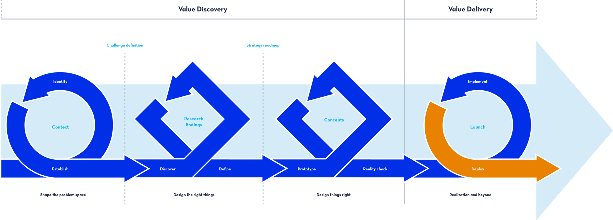
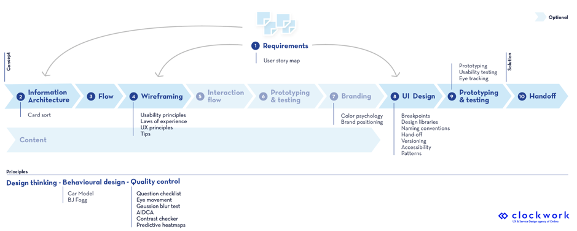
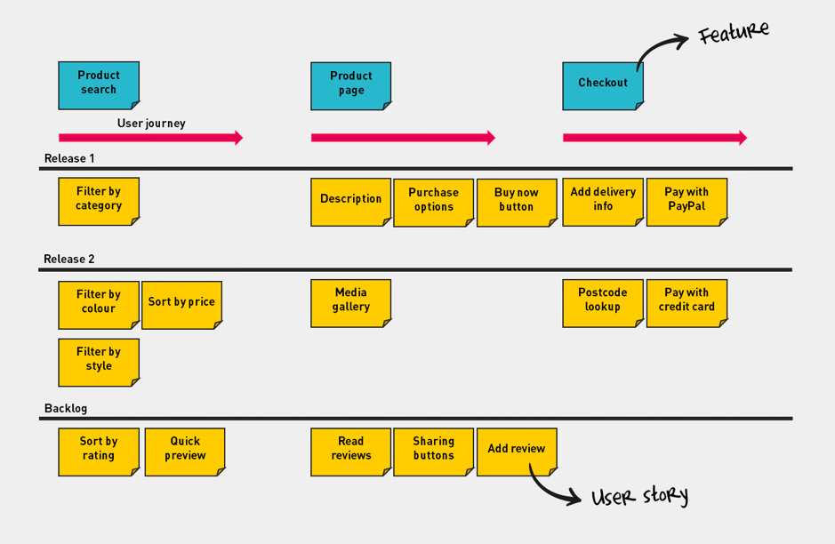
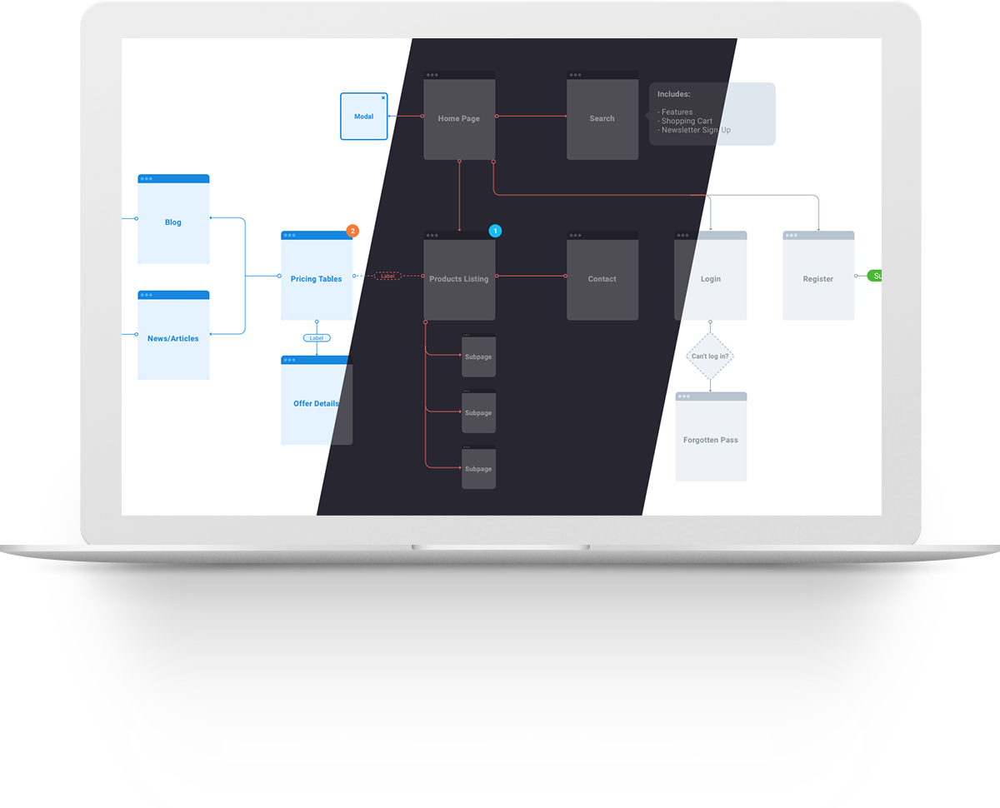
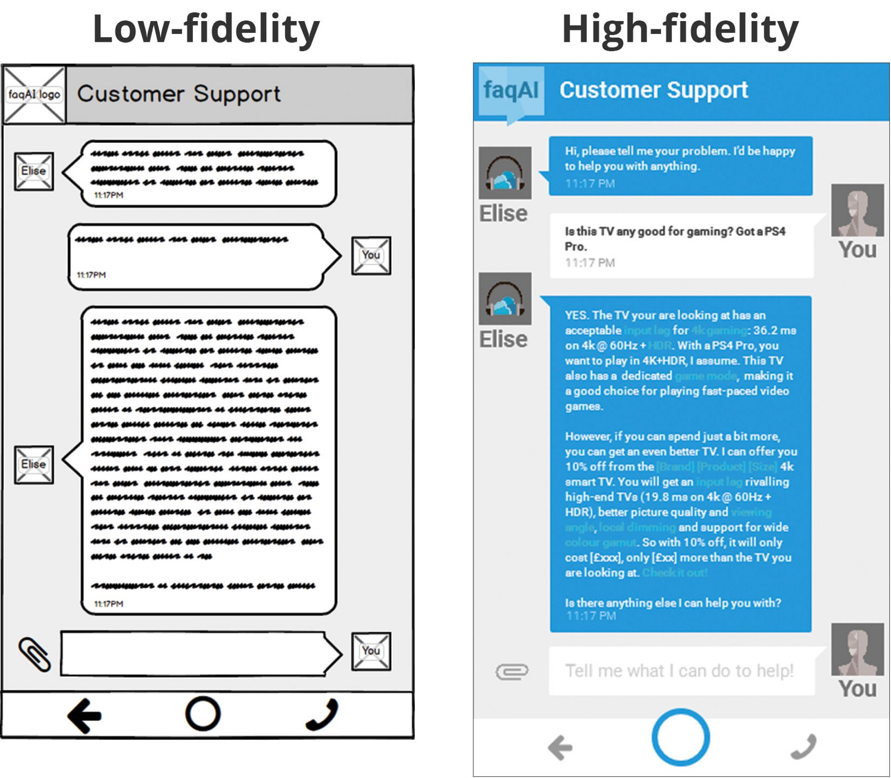
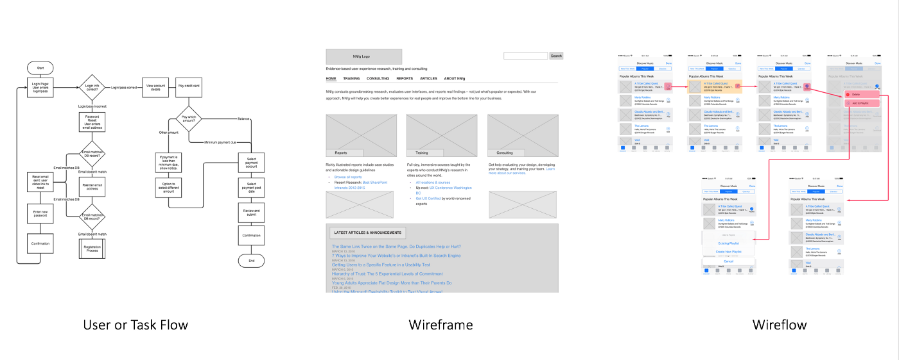

At Bold, we design digital experiences based on business requirements, extensive research, and user needs. We do this using a human-centric, value-driven design process. But just like Rome, our design process wasn’t built in a day.

With our team and the number of incoming projects growing steadily, we felt a need for **a review of our old design process**. We took the time to evaluate current approaches and methodologies and documented everything in a practical and visual guide for our team and newcomers.

## Why you should consider this

Yes, the review of a process takes some time. And yes, there might always be exceptions to this particular process. Projects and clients change constantly, that’s why our process is definitely not a rigid and solitary solution. **It’s a means to an end, a guideline, a direction to follow so you don’t get lost.**

We noticed that especially for new colleagues or people shifting roles in our team, having a handhold like this gives them **clarity** and something to rely on. This is not only beneficient for the **efficiency**, but also guarantees the **quality of work**.

## The foundations

Since the beginning, we have always used the **double diamond framework** to clearly convey our design process. The framework is simple, correct and universally used and for these reasons, still the base for our (improved) design process. 
The two diamonds represent a process of exploring an issue widely and deeply (**divergent thinking**) and then taking focused action (**convergent thinking**). This happens twice; the first diamond is about the **problem** and the second diamond regarding the **solution**. And that for us is the biggest strength of this model, it makes it impossible to deny the problem and immediately dive (too) deep in the solution.

If you take a look at the **visualization of our end-to-end Bold process**, you can clearly see the double diamond shapes represented in the second and third phases: “**Design the right things**” and “**Design things right.**”

The end-to-end Bold process

## A closer look

Now we’re going to take a look at one specific phase of our four-part process: the “Design things right” phase. We want to share some rather typical **design methods** with you, to give you the chance to compare this with your approach and provide us with feedback/recommendations for the future. We don’t expect you to be surprised or bump into major innovations in our process, but something we did to get a structured and clear-cut process is divide this phase into **10 smaller steps**. Every step has specific methods/techniques that can be used, but the final choice will always depend on the type of project, business requirements, research findings, user needs, etc. Note that this is not an exhaustive list, sometimes we deviate from this list, exploring new methods and innovative techniques. Also, this process is not sequential, it’s **iterative and continual**, always keeping the “fail fast!” mentality in mind. Lastly, the biggest power of this design phase lies in combination with the other phases. When you want to **design for impact,** design decisions must be based upon research insights and business requirements. Are you ready to discover the 10 steps we believe are crucial when creating valuable solutions? Let’s go!

### 1. Requirements

Depending on the project, we will start by defining **an approach suited for the desired outcome**. We don’t just invent requirements; we use the output, design strategy, insights, and principles from our previous phase “Shape the problem phase” like research findings and data from observations.

A good tip for bringing structure in your requirements is sorting them into useful groups using the **user story mapping technique**. This exercise provides a way of envisaging the entire product or service as a series of tasks that the user completes. Other exercises to get requirements more tangible or structured can be user journey mapping and persona story mapping. More on specific exercises in another blogpost soon!

Source: <a href="https://manifesto.co.uk/user-story-mapping/">https://manifesto.co.uk/user-story-mapping/</a>

### 2. Information architecture

Jared Spool, a usability and design expert, once said: _“Good design, when it’s done well, becomes invisible. It’s only when it’s done poorly that we notice it.”_ The same applies to information architecture (IA). When all is in order, it becomes invisible. As the word implies, the information architecture is basically **the blueprint** of the design structure, which can later be generated into wireframes and sitemaps. Even the most compelling visuals and designs can fail when the IA isn’t correct or intuitive to users.

But how do you even start creating this essential backbone for your project? A great help is a **card sorting exercise**. Card sorting is a technique that involves asking end-users to organize data written on cards into logical groups. It’s **low-tech and inexpensive**, and it gives a view on how users would organize and structure content themselves. If you use these insights, you will get a structure that suits your **users’ mental models**, rather than the business point of view. Therefore the product will be intuitive and live up to their expectations and get accepted and adopted easily.

Example of a card sorting exercise we did with Familiehulp employees

### 3. Flow

When the IA is finished, we start working on the user flows. A UX flow chart is a graphical or symbolic representation of the journey a user goes through when interacting with your solution. Design details are not yet the subject of discussion here, that’s why we can really focus on **the experience and path** at this phase. **Using the most common building blocks of a website, you can easily plan all user interactions and reduce complexity. In a way, the flow is a mix of the 2 previous steps: user story mapping and information architecture. By visualizing all insights in a flow, you get the chance to check whether you haven’t missed out on anything.** It’s also a great way to get **everyone aligned and on the same page** before starting to design.

Source <a href="https://uxflow.co">uxflow.co</a>

### 4. Wireframes

It might come as a surprise that we only start ‘designing’ in the fourth step of our process. But it’s true, there’s a lot more to the role of a UX designer than solely drawing screens. You need a clear direction and no more ambiguities left when converting a concept into wireframes. It’s not necessary to go too much into details in this phase (think: colors, typography, images, animations, etc.) At this point, we’re using the screens to get **functionalities** right and to make sure that the application is **useful and user-friendly**. The emotional layer or the graphical aspect is not yet relevant and might get in the way of the purpose now. 
Wireframes can be made in the typical tools like UXPin, Sketch, Adobe UX, but **paper sketches** also have proven to be very useful. For users, for example, there’s often a lower barrier to give (negative) feedback to sketches than to professionally designed and digital screens. And of course, this is often just more cost-efficient.

There are two options you can pick from: **low or high-fidelity wireframes**.

Source <a href="https://www.oreilly.com/library/view/user-experience-mapping/9781787123502/c2c7d77e-43ee-46cd-9e29-1632e2ae2f08.xhtml">www.oreilly.com</a>

As seen in the picture; **low- fidelity wireframes** display the layout and hierarchy of items and use dummy content (often: lorem ipsum). **High-fidelity wireframes** are usually the next step, using grayscale or colour, and they show actual content. If you want to know more about the differences between both types and how/when to use which one, leave us a comment and we can definitely devote another blog post on this topic. Note that there’s already a lot of (contradictory) content available, so we advise you to inform yourself well before picking one.

### 5. Interaction flow/Wireflow (optional)

Interaction flows are a **combination of wireframes and flows**. They are a useful way of communicating with project stakeholders and developers. An interaction flow will **enhance collaboration**, make everything more tangible, and will provide a **shared understanding**. As you can see this phase is optional, it’s definitely practical but sometimes there’s no real added value when wireframes and flow are already worked out or when the budget does not allow this extra step.

Source <a href="hhttp://www.nngroup.com/">NNGroup.com</a>

### 6. Prototyping & testing (optional)

In this phase, you get the chance to test wireframes with end-users and business for the first time. It can be **a good assumption check,** and it will save you a lot of (re)design work because at this point, wireframes aren’t animated and clickable yet. However, testing sessions can require a lot of organization, so clients might decide to wait for a clickable prototype to test with and might see 2 testing sessions as overkill (see step 9, where testing is mandatory). In any case, it’s definitely worth to try and suggest testing in an early stage. You can always try to compromise by testing inside the project team/with business and or colleagues instead of the more troublesome recruitment of users.

### 7. Branding (optional when branding guidelines are available)

**Form always follows function.** But an application, website, or any (online) tool must be appealing if you want it to be used. Don Norman, another design guru, talks about this in his ‘3 levels of Design Appeal’. Everything starts with the first level: The **visceral** one. It refers to the perceptible qualities of the object and how they make the user/observer feel. **A “Love at first sight”-experience** will encourage positive socialization with the product. Luckily, most of our clients have branding guidelines that we can immediately use. If not, we’re there to help position the client by creating a strong **brand identity** together.

### 8. UI Design

When all the conceptual thinking and designing are finished and validated, we start combining our wireframes with the client’s branding into designs or real **user interfaces**. Subtopics we take into account are breakpoints, design libraries, contrast checking, naming conventions, version control, accessibility, design patterns, resolutions, and so on. For example: here we will convert a mobile design in an iOS or Android interface. At this stage, that visceral layer is again of significant importance. We want a good first impression of the design, both in terms of how the user perceives the product and how it makes the user feel. So we need to be sure everything is well balanced, clean, structured, and appealing.

### 9. Prototyping & testing

All too often forgotten, but so important: A real check with **end-users** to see if the design is able to do what it has to do (**effectiveness**) and whether it’s done in a user-friendly manner (**efficiency**). The most significant advantage of testing the application at this stage is: **not a single line of code is written yet**, so further changes won’t have a big impact on budget and development work. We can easily adjust and refine wireframes or prototypes, sometimes even during the tests itself. It goes without saying that testing this early, not only has a **positive effect on the budget** but on the **team motivation** as well!

There are different types of testing: ranging from standard **usability tests** to the more extensive **eye-tracking tests**. Our task as designers in this phase is to faithfully recreate the product by linking all pages and, if needed, adding animations. Our team of **researchers** will assist during the testing sessions by providing guidelines, writing clear hypotheses & scenarios, and helping users during the tests.

### 10. Handoff

At Ordina, we have a giant army of skilled developers. So it‘s only normal we also created **guidelines and best practices to facilitate the collaboration and handover between design and development**. We always try to involve our technical experts as soon as possible to check whether our designs are technically feasible. By doing this, we avoid later surprises in terms of planning, scope, and budget.
Currently, we use Abstract software for example, to ensure that the developers always have a single source of truth. They can also download all assets and view specifications without breaking designs. In most cases, we also stay involved during the development, where we both **validate** what has been built and **work out solutions** for problems and changes that occur along the way. By doing this, we ensure that the quality is guaranteed and that the time to market is kept short.

*So far, this sneak peek into (a part of) our Bold design process. If you have any questions, feel free to reach out! Of course, we also value your feedback and suggestions on this topic to keep finetuning and improving our process. 
Do you want to collaborate in your next design challenge or just have a coffee so we can get to know each other? _Feel free to contact us!_*
