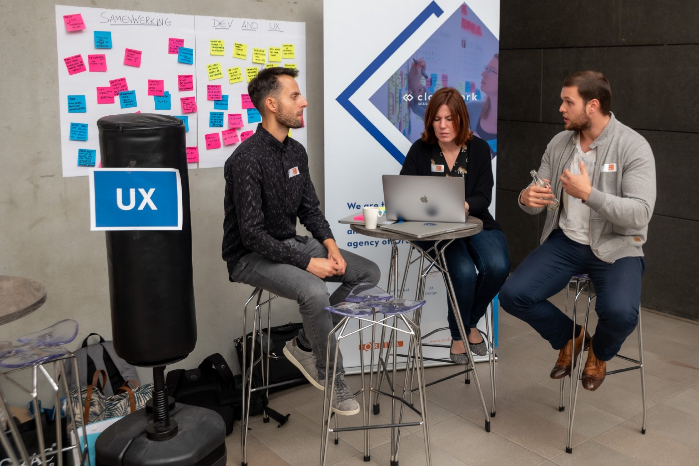
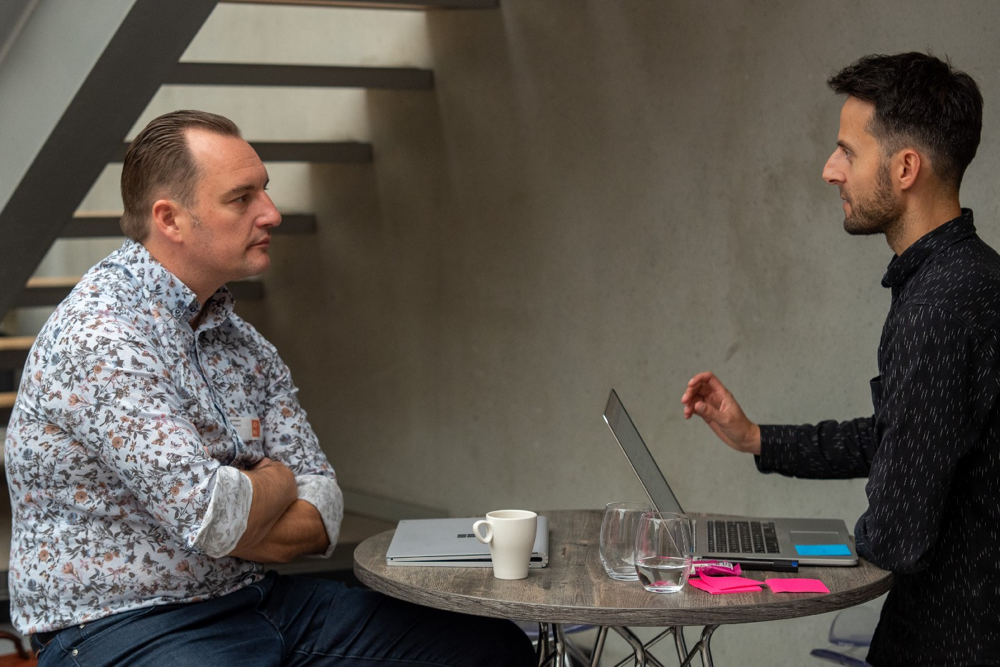

Teamwork makes the dream work — it’s a cliché, but one that very much applies within agile teams. These teams are by default multidisciplinary teams, composed of team members with different backgrounds combining diverse areas of expertise. As UX researchers and UX/UI designers, we collaborate in such teams on a daily basis, working, among others, with developers who build upon our research insights and designs to develop applications. 

We have found that teamwork within these teams can be challenging — as in any team. When working with developers, for example, we sometimes feel that our designs are not implemented in the exact way that we had envisaged them. At other times, we find that our user research insights are not properly translated into applications because they need to make way for technological requirements. It is rather challenging, in such cases, to bridge the gap and find ways to avoid starting a two-way blame game, yet it is crucial to the success of our projects that we do so.

We obviously know our side of the story, as UX professionals, but how do developers experience working with us? We’re a design agency that strongly believes in human-centered design. We are therefore convinced that in order to improve the collaboration with developers as part of agile teams, we — and, by extension, the full UX community — need to get into the minds of developers — our users. We cannot work out solutions for improving our working relationship with developers without understanding their perspective.

Therefore, we decided to set up a study aiming at **improving collaboration between UX professionals and developers** and **boosting the quality of the end product **that we collaboratively build for users. We started out by interviewing a number of Ordina developers in an explorative manner, asking them how they experience working with UX professionals (designers and researchers) and what they feel are the main challenges or pain points. Next, we headed to a conference to reach a broader audience of developers and ask them about their perspectives during coffee and lunch breaks, using a ‘UX punching ball’ as a playful conversation starter.

These talks revealed a number of clear themes. For example, some developers indicated that they are not sufficiently consulted by UX professionals throughout the design process, resulting in wireframes and visual designs that are not feasible or could have been approached in a more realistic manner. **Alignment in an early phase**, then, seems important. This requires careful consideration of the composition of agile teams and the involvement of all experts from the very start of any project, as well as continuous consultation of developers during the design process.

We used the insights resulting from these first interviews to set up a <a href="https://www.surveygizmo.eu/s3/90194944/UX-DEV">survey</a> to be conducted among developers. The aim of this survey is to obtain input from the broader developer community to understand the (relative) importance of the issues we identified throughout the explorative interviews. Those insights will allow us to focus the co-creation sessions that we are planning, involving both UX professionals and developers, to jointly develop solutions for the issues that were identified. A first dry-run of our survey took place at NG-BE, a 2-day Angular conference that was held in December 2019 in Ghent.

We were also pleased to learn, during the exploratory interviews, that developers clearly consider the **involvement of UX professionals in development processes as an added value**. Among other things, the availability of wireframes and visual designs allows them to focus on their key tasks, and the visualisation of functional requirements in designs makes it easier to align with clients. The involvement of UX professionals who don’t have a technical background but are able to take the users’ perspective furthermore provides developers with sparring partners to check their work with what users require.

These are a number of first insights, which we’re currently exploring further through our survey. **Are you a software developer, and have you worked with UX/UI designers and/or UX researchers in the past? Provide us with your input on collaboration with UX professionals by filling out the** <a href="https://www.surveygizmo.eu/s3/90194944/UX-DEV"><strong>survey</strong</a>. Doing so will take about 5 minutes of your time. We’ll be sharing the findings and the concrete action points resulting from our study in future blogposts and at conferences. We have just arranged for our first presentation to take place at a UX conference this Spring; keep tuned for more information on where and when!
