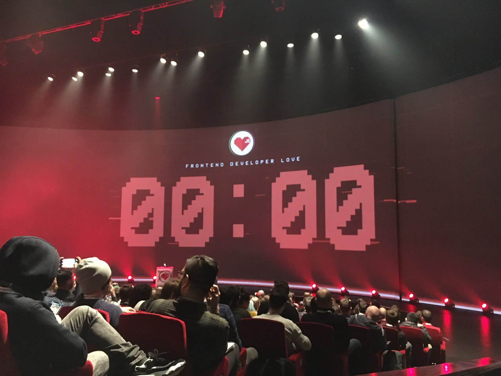
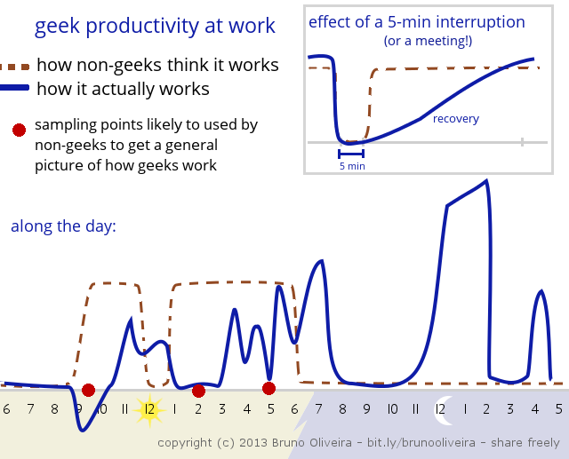

# Introduction

The Frontend Developer Love conference day was the first of 3 conference days that I was visiting in Amsterdam.
While the last 2 days were focussed on VueJS, the first day was filled with more generic frontend topics.
These topics ranged from Webpack, serverless to micro-interactions and more inspirational talks.
With a big countdown clock, the conference was about to start.



# How thinking small is changing software development big time, by [Sander Hoogendoorn](https://twitter.com/aahogendoorn)
As a keynote, we started the day with a non-technical talk.
These days we developers face mainly two challenges: the speed at which we have to deliver results and the legacy code that we must handle.
With the constant changing technology landscape, we can expect that software will not survive for 1000 years.
Regularly adapting and delivering is a key component of delivering quality software.
Sander talked about his current and previous experiences in the volatile world of software development.
Like how a 9-to-5 mentality is not always the right choice as not everybody is that productive during the day.

Factors such as strict working hours ruin productivity.
But the same can be said about the usage of open floor plans which explains the popularity of noise-cancelling headphones.
We need to think for ourselves and don't copy what other big corporations might be doing.
In the end, it all boils down to trying to release as fast, as often and as small as you can.
Even if that means following weird office hours...

> Check out [Sander's talk](https://www.youtube.com/watch?v=64LI5v470VY), [Sander's Twitter](https://twitter.com/aahogendoorn), [his slides](https://speakerdeck.com/aahoogendoorn/its-a-small-world-after-all-full-edition-fall-2019) and the [geek productivity chart resource](https://www.insanityworks.org/acme/2013/5/14/geek-productivity-chart.html)

# How to pack your Webpack, by [Johannes Ewald](https://twitter.com/jhnns)
In this talk, Johannes explained more what Webpack is and how you can define your own Webpack config.
While most frontend developers use CLIs these days, a lot can be learned from actually writing a Webpack config so that you know what your favourite CLI is generating.
With the latest Webpack we now have TypeScript support in our Webpack config file.
He also described the several key components of a Webpack config.
Such as the `entry` element which denotes the base of your module tree.

In the end Johannes gave a couple of tips to create a good Webpack along with some tips for your code to decrease the bundle size that Webpack will generate: 

* Most apps will have a good bundle size just by setting the Webpack `mode` to `production`. You don't need to overthink your configuration, Webpack already optimises a lot for you
* Lazy load modules with the use of `import()`
* Check [bundlephobia.com](https://bundlephobia.com) to determine if a bundle could be replaced by something more lightweight or more tree-shakeable
* Measure the performance with a tool like [Lighthouse](https://developers.google.com/web/tools/lighthouse/)
* Don't overestimate long-term caching. It is ok for fonts, images and CSS but caching whole pages could be not as rewarding for the amount of effort you need to put into it
* Minify your CSS with a tool like [optimize-css-assets-webpack-plugin](https://github.com/NMFR/optimize-css-assets-webpack-plugin)

> Check out [Johannes' talk](https://www.youtube.com/watch?v=z8YP5ZEUIxA), [Johannes's Twitter](https://twitter.com/jhnns) and his [slides](https://peerigon.github.io/talks/2020-02-19-frontend-developer-love-how-to-pack-your-webpack/slides/#/)

# Svelte: the last framework we need?, by [Alexander Esselink](https://twitter.com/DexterLabsNL)
On its website, [Svelte](https://svelte.dev/)  claims to allow you to write "cybernetically enhanced web apps".
But what does that mean?
Alexander tried to explain why Svelte is such a great framework.
To start with, Svelte is [truly reactive](https://svelte.dev/blog/svelte-3-rethinking-reactivity).
While in most frameworks you need to call certain functions like a 'set' or 'setState', Svelte parses your JS to add reactivity.
So a basic statement like `count += 1;` will be reactive as all code that relies on the value of `count` will be updated.
An example Svelte component could look like this:
```html
<script>
	let count = 0;

	function handleClick() {
		count += 1;
	}
</script>

<button on:click={handleClick}>
	Clicked {count} {count === 1 ? 'time' : 'times'}
</button>
<style>
button {
	border: 1px solid red;
}
</style>
```
As you can see, we have grouped everything of the component into one file: styling, the script and the HTML code.
Between the style tags, you can put your regular CSS.
Between the script tags, you can put JavaScript while your HTML can reference anything that you've defined within your script tag such as `count`.
This allows for the creation of small readable components that anybody, even someone without prior knowledge of Svelte can read.

> Check out [Alexander's talk](https://www.youtube.com/watch?v=U4ll3QWkpD4), [Alexander's Twitter](https://twitter.com/DexterLabsNL), [Svelte.dev](https://svelte.dev/)

# Serverless gives you wings, by [Yan Cui](https://twitter.com/theburningmonk)
These days we can expect that we will have users of our web applications that are distributed around the world and they will use our web app 24/7.
Because of this, deploying your web application into the cloud is very interesting.
It is resilient, scalable, fast and secure.
As we always need to prepare for success, these are all contributing elements to choose for something in the cloud.
For some, using Docker seems to be the holy grail, especially in combination with container services like Kubernetes.
But to quote Matt Klein: "Unless you're an infrastructure company, infrastructure is basically overhead".

Going serverless means that:
* you don't pay for it if no-one uses it
* you don't need to worry about scaling
* you don't need to provision and manage servers

With the help of Functions-as-a-Service tools like [Google Cloud Functions](https://cloud.google.com/functions), [AWS Lambda](https://aws.amazon.com/lambda/) and more, frontend developers can leverage whole blocks of business logic into functions that live in the cloud.
As a result, they can decrease the amount of work that backenders need to do, thus allowing them to focus on more critical stuff and not being occupied with providing some basic API.

> Check out [Yan's talk](https://www.youtube.com/watch?v=A6wbpkSmhrA), [Yan's Twitter](https://twitter.com/theburningmonk) and his [slides](https://www.slideshare.net/theburningmonk/serverless-gives-you-wings)

# Modern solutions for e2e testing, by Anastasiia Dragich
During her talk, Anastasiia gave an overview of all current end-to-end testing frameworks.
While the [Selenium WebDriver](https://www.selenium.dev/projects/) can be considered as Genesis, we have seen a steady rise of different e2e frameworks.
If you're looking for an all-in-one solution, [Cypress](https://www.cypress.io/) is the obvious choice.
But we have some other options although they might not be all-in-one solutions.
[Puppeteer](https://pptr.dev/) for example is a quicker alternative as its only task is to control a browser so you can add your own testrunner like `jest`.
But while Puppeteer is a valid choice, there is a new kid on the block called [PlayWright](https://github.com/microsoft/playwright).
PlayWright is built by the same Puppeteer people who now work for Microsoft.
It is a Node library to automate the Chromium, Webkit and Firefox browsers with a single API.

An example of how powerful PlayWright is, lies in the fact that we have full control over the browser context.
For example, we can emulate that we visit a website from a specific location with a specific type of mobile browser and take a screenshot:

```javascript
const { webkit, devices } = require('playwright');
const iPhone11 = devices['iPhone 11 Pro'];

(async () => {
  const browser = await webkit.launch();
  const context = await browser.newContext({
    viewport: iPhone11.viewport,
    userAgent: iPhone11.userAgent,
    geolocation: { longitude: 12.492507, latitude: 41.889938 },
    permissions: ['geolocation']
  });
  const page = await context.newPage();
  await page.goto('https://maps.google.com');
  await page.click('text="Your location"');
  await page.waitForRequest(/.*preview\/pwa/);
  await page.screenshot({ path: 'colosseum-iphone.png' });
  await browser.close();
})();
```

In the end, there are multiple tools available to perform e2e tests on your web application, you just have to pick the one that best fits your needs.

> Check out [Anastassiia's talk](https://www.youtube.com/watch?v=KdjYUtjVs3I), [Selenium WebDriver](https://www.selenium.dev/projects/), [Cypress](https://www.cypress.io/), [Puppeteer](https://pptr.dev/) and [PlayWright](https://github.com/microsoft/playwright)

# Practical a11y for web apps, by Bob Bijvoet
Even before you start writing a11y specific HTML such as the `aria-label` attribute, we can take certain tips into consideration to make our web apps more accessible.
As a start, our pages should be perceivable:

* Logical ordering of elements: what's important such as an article header should come first
* Don't rely on colour: be aware that not everybody can perceive colour the same way as you can. Use shapes and different sizes to distinguish between elements, colour in itself is not enough
* Use contrast: all different elements should be distinguishable one from the other
* Don't rely on orientation: with the rising number of mobile users, you should keep in mind that not everybody uses their phone in portrait mode, make sure that your web application also works in landscape mode

While trying to make your page as perceivable as possible, don't forget to focus on making your page operable.
A lot of users rely on a keyboard so make sure that they can tab through your content easily.
Having a logical focus order makes most sense.
To make your page more operable, add labels to UI elements to help them describe what they do.
For example, it is of no use to add a search icon to a search button without adding the "Search" text somewhere.
Screen reader users will be very grateful for such small adaptations.

Most of the tips that Bob gave were easy to verify on your own.
For example, try to use your web application with only your keyboard to check if it's easy to operate.
Or how about turning of your CSS to see if the order is logical and if your application is still usable.
And if you can, try to use your web application with just a screen reader.
On a Windows, [NVDA](https://www.nvaccess.org/) is a good option while MacOS X has the [VoiceOver](https://www.apple.com/voiceover/info/guide/_1121.html) option.

> Check out [Bob's talk](https://www.youtube.com/watch?v=btxOl52LTns)

# Micro-interactions with React Spring, by [Emma Bostian](https://twitter.com/EmmaBostian)
Micro-interactions are small animations.
They are important in your web app as they have a lot of added value.

* They enforce perceived performance
* They illustrate a state change
* They draw attention to something
* They inform the user about the status of a task
* They build habits
* They delight our users

Ideally, for each interaction that results in a state change you should have an animation.
This will help improve the user experience as the user will better perceive what has changed.
It is best to keep in mind that:

* Animations should be accessible. Accessibility should never suffer from the introduction of an animation
* You should make them relatable
* You should be intentional with the placement
* You don't let your users wait. Why not already start an animation while for example your backend call is going?

During her talk, Emma showcased her live coding skills as she took a full screen menu and animated it with the use of [React-spring](https://www.react-spring.io/).
React-spring looks to be an interesting library that exposes hooks such as `useSpring()` to easily configure animations.
Having for example a menu slide in from the top of your page with a change in opacity, could be something as simple as this in your component:

```javascript
const [fullMenuVisible, setFullMenuVisible] = useState(false);
const fullMenuAnimation = useSpring({
	transform: fullMenuVisible ? `translateY(0)` : `translateY(-100%)`,
	opacity: fullMenuVisible ? 1 : 0
});
```

After that you can add `fullMenuAnimation` to your HTML with the react-spring factory `animated`.
A menu can thus end up like this:

```html
<animated.div className="menu menu--full" style={fullMenuAnimation}>
	<nav>
		<ul className="menu-list menu-list--full">
			<li className="menu-list-item menu-list-item--full">
				<a href="/">Home</a>
			</li>
			<!-- more elements -->
		</ul>
	</nav>
</animated.div>
```

> Check out [Emma's talk](https://www.youtube.com/watch?v=NBb5Dt-uc40), [Emma's Twitter](https://twitter.com/EmmaBostian), [React-spring](https://www.react-spring.io/), the [Codesandbox with the end result](https://codesandbox.io/s/boring-sun-qe6kn?fontsize=14&hidenavigation=1&theme=dark), [Emma's blog post about micro interactions part 1](https://stackoverflow.blog/2020/01/16/how-to-create-micro-interactions-with-react-spring-part-1/) and [Emma's blog post about micro interactions part 2](https://stackoverflow.blog/2020/01/23/micro-interactions-with-react-spring-part-2/)

# But, you're not Facebook, by [Kitze](https://twitter.com/thekitze)
"This is going to be the most entertaining talk of the day, mark my words", said the friend next to me.
And he was right, Kitze was able to give a fun yet very interesting talk about the current culture in IT companies.
We tend to aim for certain goals that are just not necessary to achieve.
Why should you have a PWA portfolio for example?
Or what's the point in having a 100 score on all Lighthouse tests?


But what should you do?
Stop solving solved problems! 
There are already enough methods to implement button styling, state management and so on.
There are complete design systems that you can reuse, so why not reuse them?
Because ultimately, your end-users don't care about the technology.
Look at your analytics once in a while and see if your users like your app or not.
Because even if you have overengineered your app, if the end-users don't like it then there's no point.

> Check out [Kitze's Twitter](https://twitter.com/thekitze), [Sizzy](https://sizzy.co/), [Kitze's Twitch](https://www.twitch.tv/thekitze)

# Beats, rhymes and unit tests, by [Tony Edwards](https://twitter.com/tonyedwardspz)

The [Web Speech API](https://wicg.github.io/speech-api/) consists of 2 parts: the [Speech Recognition API](https://wicg.github.io/speech-api/#api_description) and the [Speech Synthesis API](https://wicg.github.io/speech-api/#tts-section).
In short, the Speech Recognition API allows you to transform speech into text and the Speech Synthesis API allows you to transform text into speech.
In his talk, Tony asked himself: how good would the Speech Recognition API be in analysing hip-hop lyrics.
Tony showcased his abilities to bring a live demo of the implementation of the Speech Recognition API.
Would it be able to transform his live lyrics into text?
Even though the technology still has a long way to go, it was still impressive that it was able to transcribe more than half of his live lyrics.


> Check out [Tony's talk](https://www.youtube.com/watch?v=x_L1eQT6TyA), [Tony's Twitter](https://twitter.com/tonyedwardspz) and a Spotify list with [songs from the talk](https://open.spotify.com/playlist/6kCeuSEq5PE7qrMebN8uNf) 

# GraphQL without a database, by [Roy Derks](https://twitter.com/gethackteam)

GraphQL is one of those technologies that a lot of frontenders want to use.
But most backenders are not that keen to add a GraphQL API to their existing REST APIs.
But why would that stop you?
There are multiple options to integrate a GraphQL API in your project without having to bother your backenders.
Roy highlighted two of them.

The first one was [apollo-link-rest](https://www.apollographql.com/docs/link/links/rest/).
This allows you to call REST endpoints from within your GraphQL queries while having all your data managed by `ApolloClient`.
These REST endpoints can be bundled together in the same GraphQL query so that getting information about a product with ID 3 and data about its rating and categories, might end up like this:

```
query getProduct {
	product @rest(type: "Product", path: "product/3") {
		id
		name
		price
		thumbnail
		categories @rest(type: "Category", path: "products/3/categories") {
			name
		}
		rating @rest(type: "Rating", path: "products/3/rating") {
			average
			count
		}
	}
}
```

Another way to integrate a GraphQL API is to use the package [OpenAPI-to-GraphQL](https://www.npmjs.com/package/openapi-to-graphql).
The idea behind this is to use an OpenAPI specification coming from something like [Swagger](https://swagger.io/) that will be used to generate a schema which will build a GraphQL server.
To help with all this, there even is a [CLI](https://github.com/IBM/openapi-to-graphql/tree/master/packages/openapi-to-graphql-cli) to make your life even more easy.

With these two tools, you can already start integrating the usage of GraphQL in your frontend code without having to rely on backend.
The backend is not forced to immediately start making the transition from classic REST APIs to GraphQL.
This is the perfect way to test out if GraphQL brings any added value to your project.

> Check out [Roy's talk](https://www.youtube.com/watch?v=yygC60yamh8), [Roy's Twitter](https://twitter.com/gethackteam), [his slides](https://www.slideshare.net/RoyDerks1/graphql-without-a-database-frontend-developer-love), [apollo-link-rest](https://www.apollographql.com/docs/link/links/rest/)

# DX is the new black. Learnings from using Nuxt and Storybook at scale, by [Aurélie Violette](https://twitter.com/purple_orwel)

Aurélie used [Storybook](https://storybook.js.org/) in her projects as a tool to demo stuff, have live documentation and to enable visually driven development.
Storybook in itself is already a great tool to showcase your components with their different use cases.
But Aurélie extended its functionality by adding the [Knobs addon](https://www.npmjs.com/package/@storybook/addon-knobs) as well as the [Docs addon](https://www.npmjs.com/package/@storybook/addon-docs).

The concepts that she uses, is to bring "Nuxt logic" to your Storybook project.
By adding components into Storybook, developers are tempted to just write the visualisation of their components with some mock data.
But why not add some business logic into it instead of just being occupied with showcasing your components?
If your actual component uses data coming from a store, why not implement a store in your Storybook stories to help you mimic the real use case of your components?
Storybook's functionality can be extended by writing decorators.
An example she gave of a decorator to add a store to your components is this:

```javascript
	
import addons, { makeDecorator } from '@storybook/addons'
import { STORY_CHANGED } from '@storybook/core-events'
 
export const withStore = makeDecorator({
  name: 'withStore',
  parameterName: 'store',
  skipIfNoParametersOrOptions: false,
  wrapper: (getStory, context, { parameters = {} }) => {
    const { modules = {} } = parameters
    return {
      created() {
        for (name in modules) {
          this.$store.registerModule(name, modules[name])
        }
        const channel = addons.getChannel()
        channel.on(STORY_CHANGED, () => {
          for (name in modules) {
            this.$store.unregisterModule(name)
          }
        })
      },
      template: '<story></story>',
    }
  },
})
```

After activating the decorator with `addDecorator(withStore)`, your components will have access to the store.
So now you can make your examples in Storybook even more linked to the real use of the components.

> Check out [Aurélie's talk](https://www.youtube.com/watch?v=R9NXT_qU7qM), [Aurélie's Twitter](https://twitter.com/purple_orwel) and her [slides](https://slides.com/aurelieviolette-1/dx-is-the-new-black#/)

# Refactor your life, by Noer Paanakker & Sima Milli

<div style="position: relative; width: 100%; height: 0; padding-bottom: 55%;">
<iframe src="https://www.youtube.com/embed/GSyQayMEID8?rel=0" width="100%" height="100%;" style="position: absolute; left: 0; top: 0; bottom: 0; right: 0;"></iframe>
</div>

Noer and Sima talked about [Hack Your Future](https://www.hackyourfuture.net/), a coding school for people that have limited access to education and the labour market.
They talked about a few of the heart breaking stories of their students and highlighted how the program helped these people try to build a brighter future for themselves.
In just over 4 years, they've helped get 120+ people land a good tech job.
With *Behind The Source*, they highlight a couple of the other stories on how being a refugee wasn't a choice but becoming a developer was a choice.

> Check out [Noer & Sima's talk](https://www.youtube.com/watch?v=jczJ9IPH-Aw), [Hack Your Future](https://www.hackyourfuture.net/) and the [Behind The Source video](https://www.youtube.com/watch?v=GSyQayMEID8)

# Blazor with WebAssembly, by [Don Wibier](https://twitter.com/donwibier)

Blazor lets you build interactive web applications in C\# instead of JavaScript.
In fact, it allows you to create a component-based UI with a combination of C\#, HTML and CSS.
Both the client and server-side code are written in C\#.
This has one big benefit: you can share code and libraries between your front- and backend code.

A really basic example of Blazor code would be this:
```javascript
<h1>Counter</h1>
<p>Current count: @currentCount</p>
<button class="btn btn-primary" @onclick="IncrementCount">Click me</button>

@code {
	private int currentCount = 0;

	private void IncrementCount()
	{
		currentCount++;
	}
}
```

Those familiar with C# and mainly .Net Razor pages, will recognise the syntax.
Razor allows you to write both your HTML and C\# in the same file.

One of the interesting features of Blazor is the ability to compile it to WebAssembly.
In fact, your client-side C\# code is being run by WebAssembly in your browser.

In a Blazor project, you even have your client-side and server-side code right besides each other.
A typical Blazor project has the following structure: 

* /Client
* /Server
* /Shared

In this structure, your whole frontend is situated in `/Client` while all your backend code is situated in `/Server`.
If you are in need of any code sharing, you can put it into `/Shared` and it will be available in both `/Client` and `/Server`.  

> Check out [Don's talk](https://www.youtube.com/watch?v=ZAFqw952GQM), [Don's Twitter](https://twitter.com/donwibier) and [Blazor](https://dotnet.microsoft.com/apps/aspnet/web-apps/blazor)

# Audio Streaming - Using WebRTC for building your own Voice AIs, by [Lee Boonstra](https://twitter.com/ladysign)

Tools like the [Google Assistant](https://assistant.google.com/), [Amazon Alexa](https://developer.amazon.com/en-US/alexa) and [Apple's Siri](https://www.apple.com/siri/) are becoming more popular.
The usage of voice assistants is becoming more mainstream as prices are dropping and they are becoming less of a gimmick and more of a tool to use during your everyday life.

And while there are lots of developer tools available to integrate your app with these particular voice assistants, this might not be your best course of action.
You're limited to the technical requirements of these assistants, they might be overkill for your use case or they might not fit for your enterprise usage.

[WebRTC](https://webrtc.org/) is an open web standard and is available as a regular JavaScript API in all major browsers.
It allows for real-time communication (RTC) in the form of audio and video communication via direct peer-to-peer communication.
[RecordRTC](https://github.com/muaz-khan/RecordRTC) is a WebRTC JavaScript library for audio, video, screen and canvas recording.
By combining RecordRTC together with a tool such as [Dialogflow](https://dialogflow.com/) that can parse voice recordings to text, we can create our very own voice assistant.

Tools such as Dialogflow use machine learning to parse voice recordings to achieve intent matching.
An intent categorizes an end-user's intention for one conversation turn.
By trying to match phrases or parts of phrases, Dialogflow tries to classify the end-user expression to the best intent.
It then tries to parse the input with the help of the intent to extract information.
For the example of weather forecast queries, if Dialogflow is able to match the queries to the forecast intent, it knows it can try to extract information such as time and location.


Linked to this intent, one can add actions to perform or responses to give.
By training the system, the classification of intents can be improved as to ensure that the voice assistant gives back the correct answer.
During her talk, Lee demonstrated the [Airport SelfService Kiosk](https://github.com/dialogflow/selfservicekiosk-audio-streaming), a demo in which microphone streaming is used to give the end-user information linked to their flight in an airport.

> Check out [Lee's talk](https://www.youtube.com/watch?v=6JD8WC1LV7g), [Lee's Twitter](https://twitter.com/ladysign), her [slides](https://speakerdeck.com/savelee/implementing-a-custom-ai-voice-assistant-by-streaming-webrtc-to-dialogflow-and-cloud-speech), [RecordRTC](https://www.webrtc-experiment.com/RecordRTC/), [Dialogflow](https://dialogflow.com/) and the [Airport SelfService Kiosk](https://github.com/dialogflow/selfservicekiosk-audio-streaming)

# The future of real-time, offline, data, by [Nader Dabit](https://twitter.com/dabit3)
When trying to write an offline-first app, you should take three things into account:

* Code should work offline & online
* Write your data locally and replicate it to a database: you should always have a local copy of all the relevant data
* Provide good user experience in case of bad internet: your app should still be usable when your user has internet issues

Your app should feel real-time:

* Give your user a sense of real-time: don't delay things and add animations to enhance the feeling of real-time
* Allow for synchronisation between multiple devices

Tools such as [AWS AppSync](https://aws.amazon.com/appsync/) and [AWS Amplify](https://aws.amazon.com/amplify/) can help you with that.
AppSync is a managed service that uses GraphQL to make it easy for applications to get the data they need from multiple sources with the option to have real-time updates.
Amplify is a framework to build cloud-based full-stack serverless apps.
By combining the forces of these two tools, we can create real-time, offline data, especially if we combine it with GraphQL.

Your data model can be defined by a GraphQL schema.
In your application, you can use GraphQL subscriptions to have real-time updates for your application data.
There are options to get updates such as long polling, server sent events and web sockets.
It depends on your use case to choose what option is best for you.

But getting real-time updates also forces you to think about conflict detection and resolution.
Like what do you do when you get multiple updates at the same time?
What if your connection is down for a while?
There are a couple of popular ways to tackle these issues.

AppSync already uses the solution of monotonic counters combined with a base table that contains all your base data while also maintaining a change table to log all operations that happen on the base data.
AppSync will auto-merge everything for you while also offering other options if necessary.
Check the [Amplify DataStore documentation](https://aws-amplify.github.io/docs/js/datastore) for more information.

> Check out [Nader's talk](https://www.youtube.com/watch?v=dkMEkD9OsPY), [Nader's Twitter](https://twitter.com/dabit3), [AWS AppSync](https://aws.amazon.com/appsync/), [AWS Amplify](https://aws.amazon.com/amplify/) and the [Amplify DataStore documentation](https://aws-amplify.github.io/docs/js/datastore)

# The state of WebAssembly, by [Sendil Kumarn](https://twitter.com/sendilkumarn)
The final talk of the day was by Sendil who came to explain what the current state of WebAssembly is.
WASM, short for WebAssembly, is a high-level definition of how to run bytecode in your JavaScript engine.
At its core, it's a stack machine that uses a linear memory model by using a shared array buffer.
Contrary to what you might expect, WASM is not faster if you would use it for lots of DOM operations.
The advantage of WASM lies in the fast calculations that can be done.

To write WASM, you can look at multiple higher-level languages that compile to WASM code.
If you're a fan of C/C++, the tool [Emscripten](https://github.com/emscripten-core) helps you out by compiling a C/C++ module to an HTML page.
For the Rust lovers, you can simply annotate a function with `#[wasm_bindgen]` to activate the [wasm-bindgen library](https://rustwasm.github.io/wasm-bindgen/) and allowing to compile a WASM function.
For the TypeScript lovers, there is a strict subset of TypeScript called [AssemblyScript](https://docs.assemblyscript.org/) that allows for compilation.

So the tools are already there to write WASM code but the future looks really bright as multiple features are currently being specified:

* [Interface types](https://github.com/WebAssembly/interface-types) to help describe higher-level values such as strings and records
* [Single Instruction Multiple Data](https://github.com/WebAssembly/simd) so that WASM will be more efficient on newer instruction set architectures up to 128-bit.
* Garbage collection
* ... and more!

All this will lead to an even better performance of WebAssembly combined with more use cases so that WASM can become a more popular standard on the web.

> Check out [Sendil's talk](https://www.youtube.com/watch?v=2KDU1qdIobA), [Sendil's Twitter](https://twitter.com/sendilkumarn), [WASM.org getting started with Emscripten](https://webassembly.org/getting-started/developers-guide/), [wasm-bindgen library](https://rustwasm.github.io/wasm-bindgen/) and [AssemblyScript](https://docs.assemblyscript.org/)

# Conclusion
The first of three days in Amsterdam was packed with lots of great talks on a multitude of subjects.
Combine those interesting topics with a great venue (the screen opened for access to the break room!) and you have a killer combination.
If this was day 1, I could not wait for day 2 and 3 that were going to be more focused on VueJS.
I returned to my hotel satisfied with the amount of stuff I had learned that day and was excited for what was still to come.

