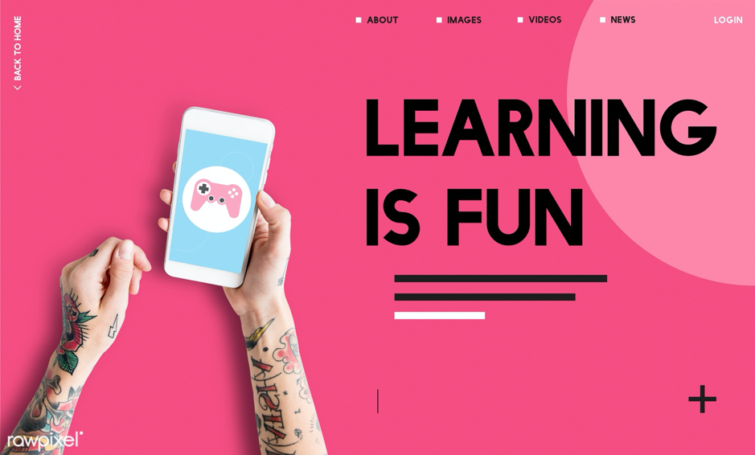
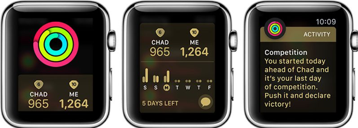
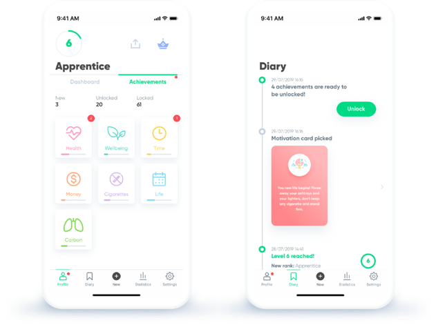
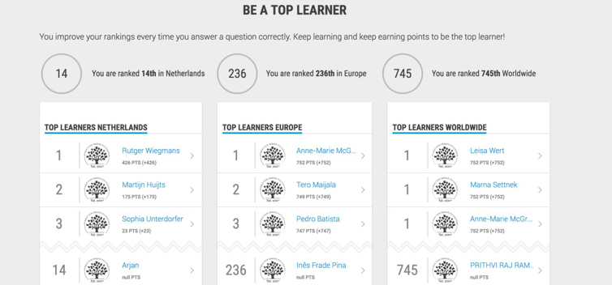
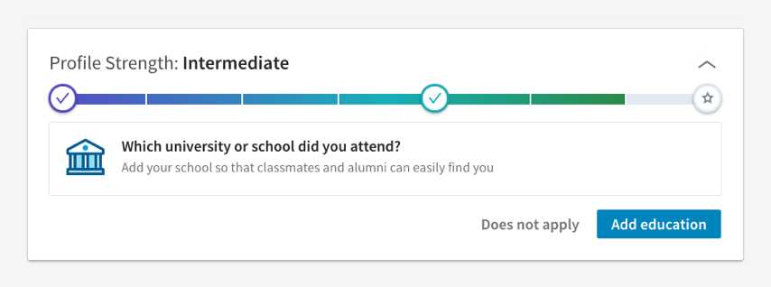
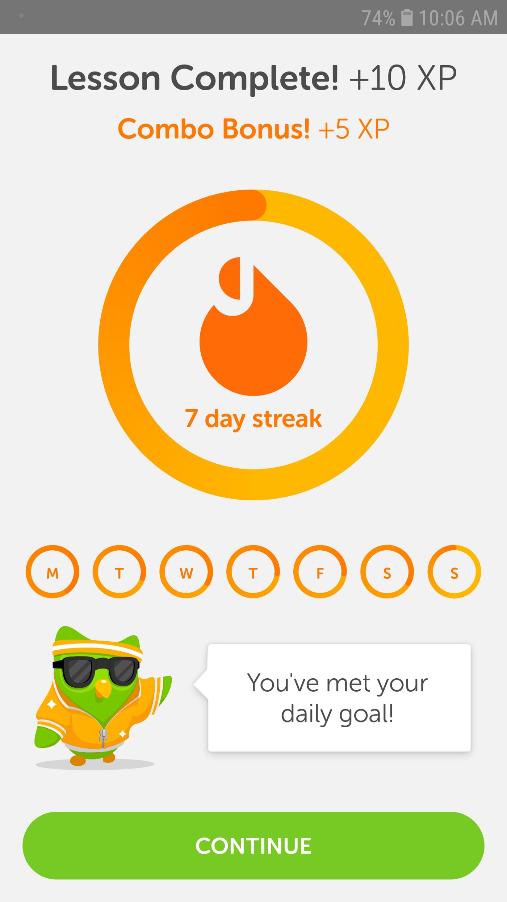
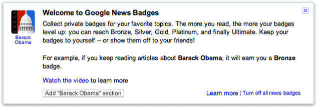

The gaming industry is skyrocketing. For hours and hours, even days and weeks straight, people are consumed by games. The user engagement in the gaming industry is definitely one of the strongest compared to any other industry. And in a world where User Experience is becoming more important over the years, we can learn a thing or two from the gaming world. And that is where gamification comes into play — pun intended!

## So, what is Gamification?

*Gamification is the use of gaming techniques in a non-game related context. Gamification is not to be mistaken with Game Design as we are not developing games but designing experiences and applications. We are merely using their techniques to improve user engagement and motivation.*

Gamification is not a completely new trend or a groundbreaking invention. Other industries have been using gamification components for quite some time now. Schools for example; when I was a child, me and my classmates were not excited about learning multiplications. That’s why my teacher organized a contest where everyone had to start at the back of the classroom. Whenever you could give the correct answer to the question, you could move one tile closer to the chalkboard in the front. Whoever got there first was the “Multiplication King or Queen” of the day. This example shows that even 20 years ago my teacher tried the challenge technique, often used in games, to motivate pupils in practicing multiplications.

Photo credit: Rawpixel*

## Gamification in User Experience

Many digital tools such as applications, websites and platforms are using gamification methods. Especially when they want to **achieve something** from their user. This can be anything from buying a new product, using a new service, signing up for updates, etc. Gamification is used to motivate users and guide them towards a specific behaviour.

There are many different **gamification techniques** you can use to boost the User Experience and we will elaborate on them later. But there are a few things you need to keep in mind if you want to choose the right one(s).

**1. Know your audience**

Get to know your user. What motivates them to execute a specific action or show a particular behaviour? Instead of user personas, you can use player personas. Very similar to user personas, player personas also examine some gamification-specific elements.

Basically, you need to build a profile of the type of player(s) you are dealing with, in order to motivate them with the right set of gamification techniques. If you wish to read more about this, just take a look at this great article: https://medium.com/@fernandocomet/the-player-persona-template-d171e3e0c05d.

**2. Determine your gamification goals**

When you want to find the right techniques to enhance user engagement for your product/service, you must first determine what you would like to achieve. What kind of behaviour do you want to spark in your user? Examples might be: I would like people to be more active on my platform for a longer period of time, I want people to read more articles, I want more users, etc.

**3. Use the right game mechanics**

Not every gamification technique is going to fit your product or service. Before finding the most suitable technique(s), you must first understand these techniques. Over the years, a lot of different gaming mechanics have been introduced in various settings.

*Let’s take a look at some examples that you probably encountered already without knowing these are gamification techniques!*

- **Challenges and badges**

Being able to complete a difficult yet doable challenge successfully can motivate many users to keep wanting to complete challenges. Make sure to adjust the challenges to your users player level. Whenever a challenge is too easy or too hard, you might get the opposite result of what you want to achieve. 

*Apple* does a fantastic job here with its Apple Watch. Users can challenge each other to exercise more. Whoever gained the most exercise points in a week wins! Exercise points can be achieved by standing up regularly, doing exercises or just by walking around. You can also earn badges by working out and exercising. They are not the main reason to do something, but it makes the workout experience more meaningful and real.

Photo credit: Apple

- **Points** 

Point systems also increase user engagement. Getting more points makes the user feel like he is getting stronger and better. And isn’t that just what we all want? 
A great example is *the Kwitter app*. It helps people to quit smoking. The further you are along without smoking any cigarette, the more experience points you get. For example: Not smoking for two weeks equals saving €100 and your lung capacity has increased by 10%. They also use levelling and reward techniques. It actually helped me to quit smoking, so if you want to get rid of this unhealthy habit you should give it a try!

Photo credit: Kwitter App

- **Leaderboards**

Next up, there are leaderboards. We know that people can get quite competitive and even enjoy rivalry once in a while. Challenging each other, receiving points, climbing up or down in ranks, etc. You can only know how great you are doing if you can compare yourself to others, right? That is why leaderboards are frequently used to motivate users. 
*The Interaction Design Foundation* that also has excellent courses about gamification uses leaderboards to motivate users to finish their courses and push them to perform well.

Photo credit: Interaction Design Foundation

- **Progress Bars**

A progress bar can be a great usability feature. 
Companies such as *Google and LinkedIn* use them as a “Completeness Meter” to show a new user how far along they are in completing their profile in order to develop a better experience with the platform.

Photo credit: LinkedIn

- **Goals**

Our last example of gamification to spur motivation is *Duolingo*. Duolingo combines various gamification techniques such as progress bars, badges, challenges, achievements, leaderboards but also daily goals. To move users to practice every day, Duolingo uses the **“Streak”** method. This allows users to check how many days in a row they completed their daily goal(s). The longer the streak is, the more experience points they receive. Though this type of technique is considered manipulative by some, it can be a valuable technique when used in the right context.

Photo credit: Duolingo

As you can see, there are a lot of techniques, and we definitely encourage everyone to give them a try, but think twice before you overwhelm your customers with an abundance of gamified features. We have listed a couple of typical challenges for Businesses, to make sure you are right on track:

***1. Gamification is not a standalone solution***

Make sure the product or service you want people to use is awesome on its own. Using gamification techniques on a shitty product will not keep your users engaged. Find out what your users need, create a wanted product/service and increase user engagement and motivation with the right gamification techniques.

> “Read 10 articles and get 10xp” does not sound more exciting than just “Read 10 articles” when the content is not interesting and poorly written.

***2. Gamification is about motivation, not manipulation***

You want to motivate your user into doing something. Still, they may not have the feeling they are forced or manipulated into doing it. They need to feel good about showing a specific behaviour, not feel bad about not doing it. There is a fine line between manipulation and motivation in gamification. The trick is to create a transparent gamified experience so users know exactly what is going on.

***3. Don’t force people to play***

Believe it or not, not everyone likes to play games. Make sure people can use your service or product without having to go through all the gamified elements. The core product or service needs to be available for those who don’t need or want extra motivation. If you don’t do this, your audience might drop out.

***4. It’s not a game***

Remember, we are not building a game here. We are merely using techniques from the gaming industry to increase user engagement. Too many gamified elements can disturb or distract the user from the main objective.

***5. Pointless gamifying***

Using gamification techniques is only effective when it is actually meaningful for your user. Throwing random badges or leaderboards at your user will not motivate them. For example, Google News wanted to make more people read their news via Google News Reader. By reading stories, people got badges. That was basically all you could say about the feature: people could not do anything with their badges, except displaying them to their network. The goal to increase reading on Google News Reader was not met because the badges meant nothing to the users. In fact, people even dropped their account altogether because they did not want to show off badges on their profile.

Photo credit: Google News

## The takeaways

Using gaming techniques from the gaming industry can benefit your product or service if you carefully consider your audience, gamification goals, and what techniques to use. But beware for pitfalls such as pointless gamifying, manipulating your user, over-gamifying your solution, forcing people to play and decorating a potentially wrong product with gamification techniques.

**Interested to see what we can do to gamify your products/services? Reach out to us!**
