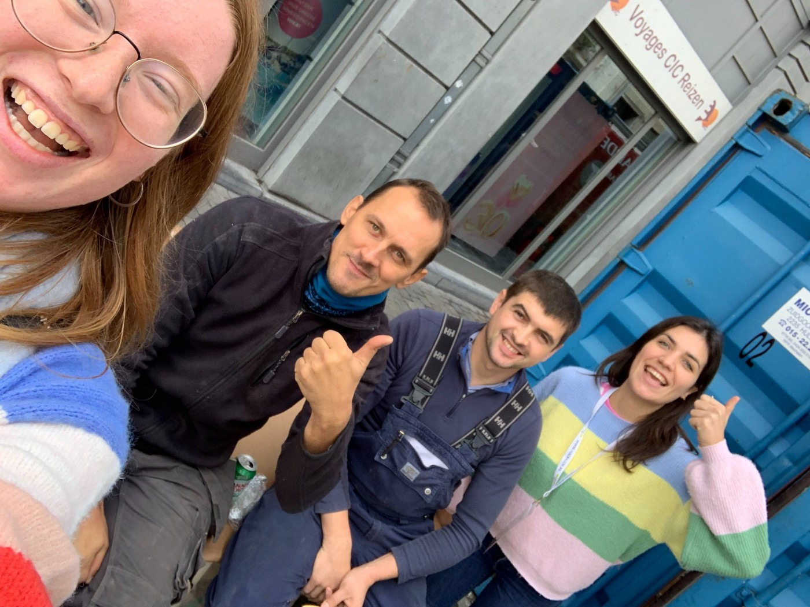
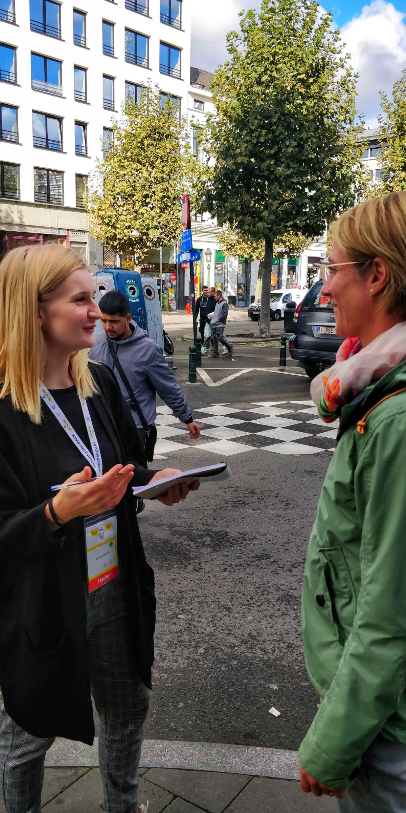
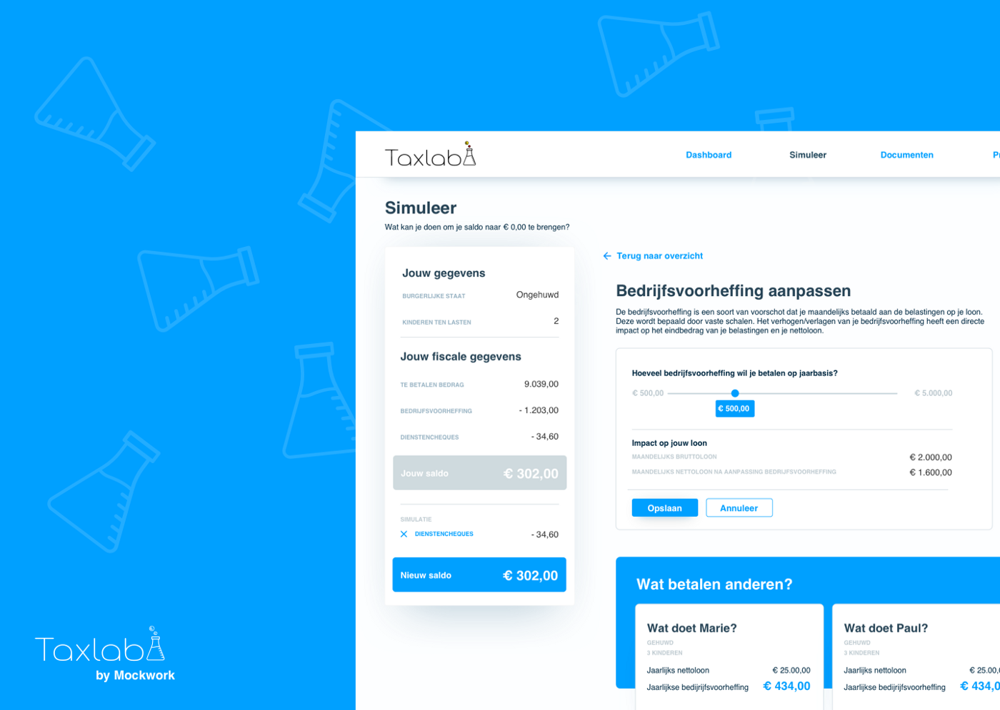
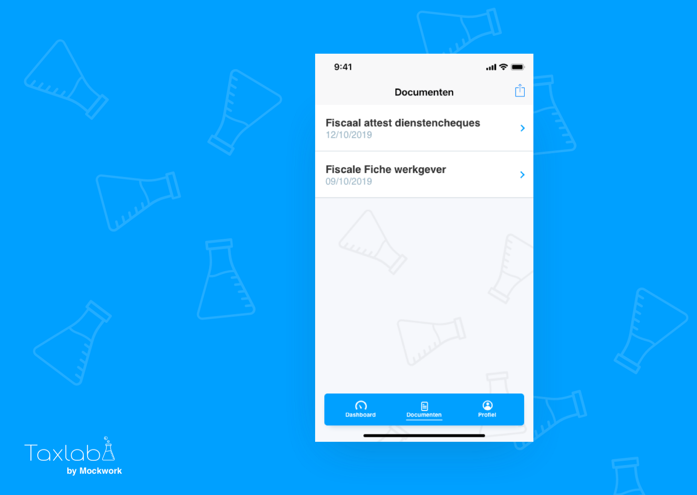
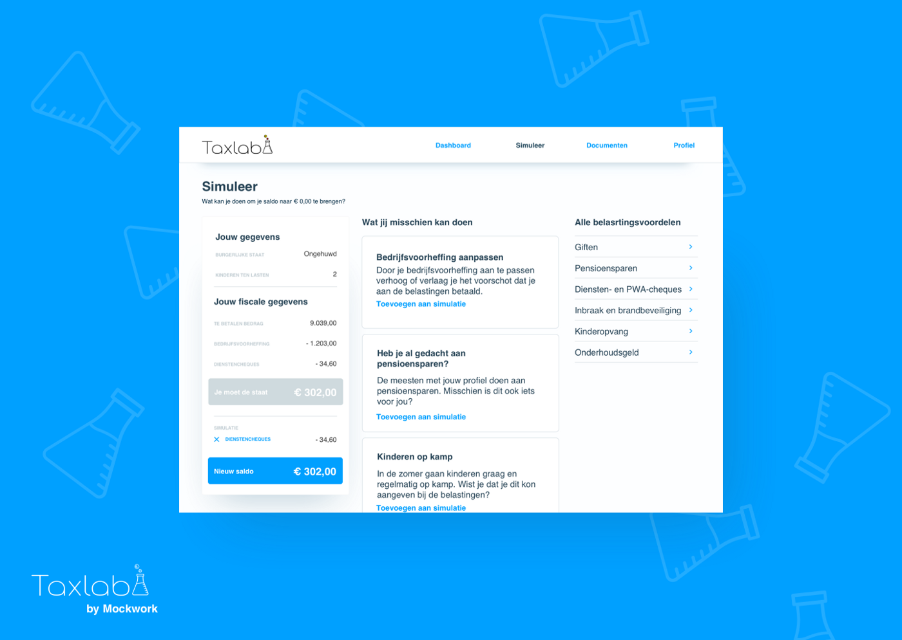
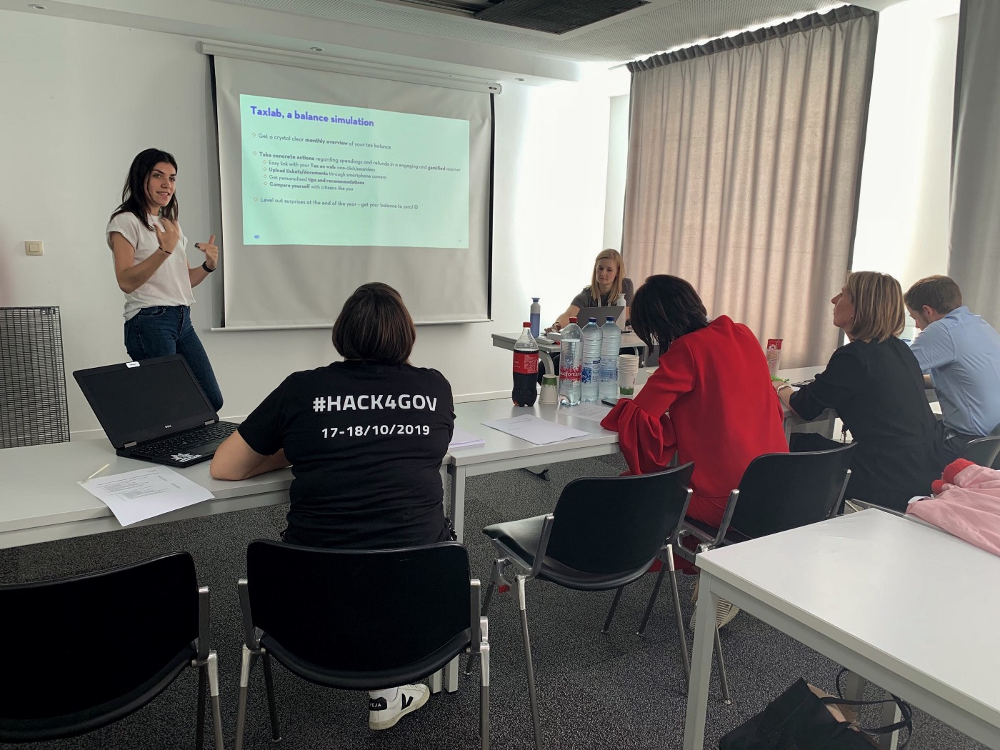
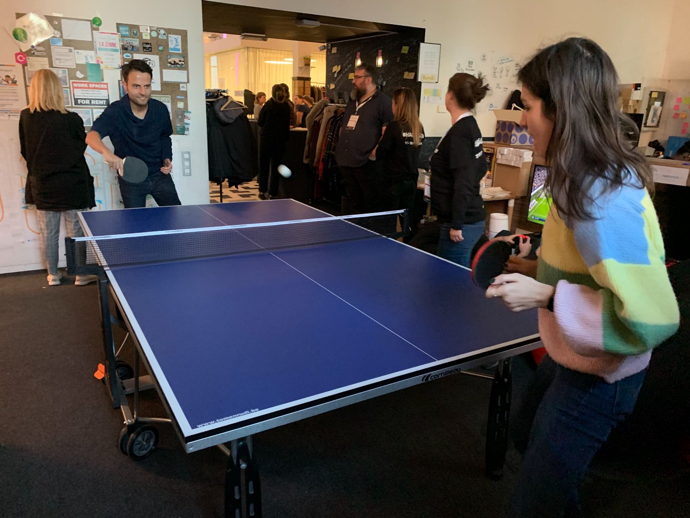

Last week the Belgian Federal Public Service Finance and Internal Affairs decided to join forces and organize their first Hackathon. For Bold, this was a no-brainer: we wanted to participate. In a fast-changing world where new technologies and solutions are popping up like mushrooms, the government can be seen as a dull and cumbersome organization. All the more reason for us to tackle their challenges. We wanted to show how our double diamond approach could help quickly generate ideas and maybe have an impact on our society, on our own lives. The government proposed six different challenges from which we chose: “How can we motivate our citizens to pay taxes quicker and more willingly?”

## Getting started

To tackle the problem, we teamed up with the lovely Maarten Vanderjeught*, *who currently works at the Federal Public Service Finance. Together we formed the team “Mockwork”.

Mockwork team and a nice view of our capital Brussels!

Of course, Bold (or Mockwork now) wouldn’t be Bold if we didn’t involve our users from the beginning. How could we create a concept to potentially disrupt our tax system and accommodate the citizens, without getting feedback from these citizens? So after arriving at the venue, we immediately left again, armed with a notepad and questions for our potential users.

Romanian construction workers that have been paying taxes in Belgium for 2 years

As a result of this guerrilla research, we learned that our interviewees in Brussels **don’t really mind paying taxes**. In general, they are grateful for our social security system, our clean streets, etc. They already understood the “why” behind paying taxes. However, they did not understand why every month almost half of their paycheck disappeared to taxes… And still they have to pay an extra amount or wait another couple of months for a refund.

## The numbers

In Belgium, every year **1 275 347 people have to pay extra taxes**, which leads up to a total of **€1 331 097 081,39** at the end of the year. There are **2 660 135 people who get money back from our government**, corresponding with a total of **€3 088 734 472**.

A question we often got from our **coaches** (yes — we haven’t mentioned the intelligent governmental experts that were walking around to challenge our ideas yet) was why getting money back was an issue.

> “Isn’t it great to get a refund from the government?”

Well, as good as it sounds, it actually is not. Because of the automatic payroll tax system, this can mean that people might have had 12 difficult financial months. Maybe canceling fun trips or not being able to buy certain necessities. When actually, they did have enough money for those things but they simply didn’t know and now they have to wait a long time to get their money back… Money that has been theirs to have from the beginning on.

> Why can’t we bring down those end balances to nearly 0 and take out the end of the year surprise for the citizens?

This would resolve in **less administration, less uncertainty and less money going back and forth**. Could we find a solution to **involve the citizens** more and transform the Financial Public Service into a **partner throughout the year that offers total transparency and flexibility**?

And hence the birth of **Taxlab!**

## Our solution; Taxlab

Taxlab is a **web app** where citizens get an accurate** simulation** of how much they owe the government, how much they already paid, and what would be the balance of the end of the year.

Its main feature: The possibility to **adjust payroll taxes** according to users’ needs. If you would see that the fees are too high and that by the end of the year you will get the money back from the government, you can decide to lower the fee. This way you can always **aim for a total balance of 0 euro** by the end of the year. If you see that you will have to pay extra at the end of the year, you can increase the amount.

Of course, we go further than only adjusting the payroll taxes. Since the platform will have a direct link with our current online tax platform, it will contain a lot of personal information. With the help of this info, the app can provide **tailored information and suggestions about tax advantages **personalized for you and your situation. For example, if you have children, it will ask you if your children went to summer camp. Why? Because you can deduct an amount for this from your taxes.

These suggestions will provide total transparency from the government to their citizens on how taxes work.

The web app can be accompanied by a mobile app variant where users can upload evidence on the go, on everything that they try to deduct from their taxes.

We designed a logo and created some screens to work out our concept visually and user-friendly.

## Impact

For the government our solution also meant a **giant reduction in costs** (transactions, FTE’s,…) **and work** (returning peaks in workload and information providing). This **gamified & fun approach** was also a good opportunity for the FOD to change its **image** from dull and/or thief towards a transparent partner trying to help citizens with their taxes.

## Aftermath

Unfortunately, our idea did not win the challenge. However, we learned a lot from the feedback we received — and that was the main goal of this day anyway! The judges found that our idea was too focused on the individual user and not on our society in general. Also, there was a concern that when payroll taxes would become flexible, people might not be able to pay their taxes at the end of the year. They did like our designs & cheered for us because we were **the only team that went out to talk with real end-users**. Overall, Taxlab was seen as very (or maybe too?) **innovative, creative and fun!**

Pitch time!

> Although we did not win, we had a great time! We are grateful for the opportunity and to be part of such a vibrant event with so many other enthusiastic people, trying to solve real problems for our society!

