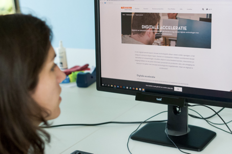
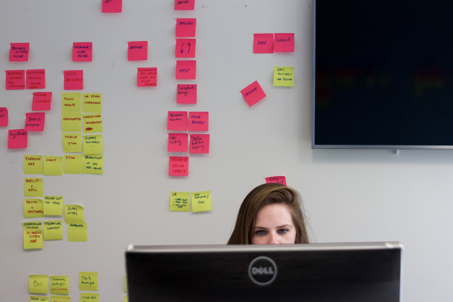
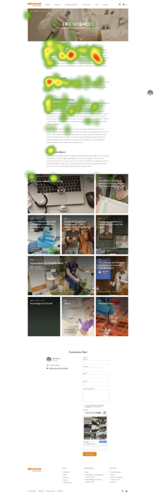
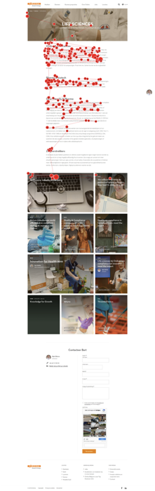

Most of our day to day decisions are primarily made subconsciously. 
If we asked people why they choose one item over another during an online shopping experience, a lot would struggle to explain their decision and assign it mainly to ‘gut feeling’. When navigating interfaces and using digital tools, the subconscious mind of the user is looking at cues to decide where to interact with the system. With this in mind, the following question arises: “How can you gain insight into the subconscious mind of your users beyond traditional user research methods?”

At Bold, we use modern Eye-Tracking methods. With these, we can *measure eye movements* and accurately capture *where users are looking* on a screen, both consciously and subconsciously. By using a screen-mounted sensor, there is no need for a bulky pair of glasses, allowing participants to act naturally during tests.

## How does this work?

We combine traditional task-based user research and contextual information with behavioral Eye-Tracking data. This allows us to get a deeper understanding of what causes user behavior, allowing us to effectively identify and offer targeted solutions to usability issues or a lack of customer engagement.

## How do we go about conducting an Eye-Tracking study? And when is an Eye-Tracking study worthwhile?

Eye-Tracking can be used at any stage in the design, development, or update of a tool, product, or service. Once screens have been prototyped, an Eye-Tracking study will allow a project team to gain a *deep understanding of user behavior before the team starts using up valuable resources building a product that may have significant flaws*. Eye-Tracking is also a powerful tool when trying to compare two designs since it offers quantified information about user performance (AB-testing).

First, we start by gathering the requirements. Business, user, and other stakeholder needs are consolidated into the needs of the product, service, or system. For example, a business need for a webshop company could be to reduce the number of calls a call-center receives from its customers, indirectly increasing costs. Next, we write scenarios that correspond with the most essential use cases. Taking the webshop example, this could be ‘User is unable to find information about returns or warranty.’ This is followed by conducting a usability audit to identify potential usability issues. *Each screen is then examined based on the tasks to be carried out, and positive hypotheses are supposed that are directly linked to usability goals*. For instance, ‘User is able to find FAQ page within five seconds.’ Finally, after setting up the hardware needed to perform the test, a base-line test is conducted to be able to score performance during the real test.

During the test itself, each user’s eye behavior is calibrated to the screen to allow for accurate tracking. Once this is complete, the user receives background information about the scenario and a clear task to complete such as ‘Look for the return conditions and where you need to return your product to.’ Throughout the test all Eye-Tracking data is captured and stored. Time-based metrics are compiled that indicate performance such as *time to first fixation *and *total time spent looking at an area of interest* (such as a visual, text or call to action). This allows the moderators to compare participant performance to the base-line target times.

Once the test is completed and data is gathered, our team sets out to validate the hypotheses for every screen. Where performance is insufficient, the causes are identified and backed up by Eye-Tracking behavior. By being able to map where users look on the screen, we can determine where they instinctively look for the requested information. Next, the team sets out to offer expert-level design recommendations that will mitigate the demonstrated issues. Finally, the test results and potential solutions are presented to the team in common terms so the whole team is invested in the outcome.

## What can this approach mean for you?

* Find out *where* customers look when visiting your website
* Discover if your product is capturing customers’ *attention*
* Identify critical issues *before you start developing* your digital products/services
* *Compare existing products* to new products and get actionable insights
* Evaluate the *usability* of your digital products
* Get *clear visual deliverables* about user behavior

**Want to know more about Eye-Tracking and whether it’s the right thing for you? Feel free to contact us!**