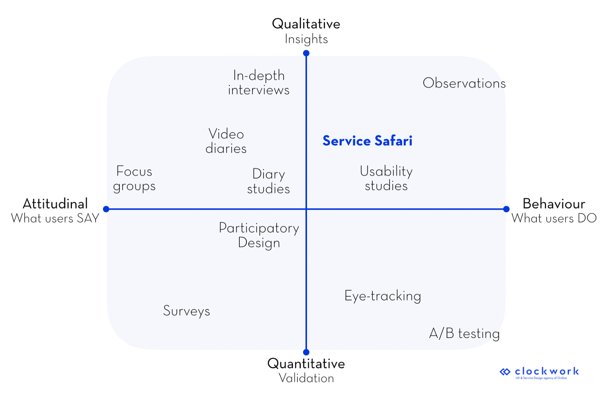

Safari what? We know, this sounds more like an adventurous and exotic trip than a qualitative research method. The good news is: this approach is as exciting and as worthwhile as it seems. When you know how, when, and why to use it, this can really help you to take your project to the next level.

First things first: What is a Service Safari? This is a **qualitative research method** that allows you or your team to observe and document a service “in the wild.” You can see it as the elder sibling of another generally known technique: **Mystery Shopping**. However, with Service Safaris, we don’t limit ourselves to a shopping experience; we analyze entire services in any industry, not only in commerce. This approach is typically used in the **discovery or understanding phase** of a project.

## Why should you consider Service Safaris?

Service Safaris have the power to generate significant insights in three areas:

- **Which services exist in a company**, both in terms of process and emotional experience

- **How your competitors are serving their customers**

- **What and how other companies deliver great or terrible service experiences**

 

A couple of **advantages** of using Service Safaris as a qualitative research method arise immediately. 
First of all, there’s **no need to recruit users** for this exercise, because you or your team can easily do it! This means that many potential complications disappear (high costs, lack of good quality, annulations, etc.).

Second, it’s often the only way to quickly **gain insight into your competitors’ way of doing things**. When you are — like us — consultants working for a company, chances are rare that your client can provide you with user insights or process approaches from competitors.

Thirdly, by stepping into the shoes of the user and physically entering their space, you will automatically **increase your empathic ability.** Allowing you to better convince stakeholders of certain findings. Coming back from Service Safaris you’ll be able to tell captivating stories which will **increase the chances of getting** **buy-in**. Finally, this will also allow you to clearly differentiate between quick wins and the main pain points.

Note that a **combination of qualitative and quantitative** research methods (for example combining Service Safaris with observations, one-on-one interviews, and surveys) will increase your chances of arriving at great insights and thereby creating more valuable solutions.

## Planning your first Safaris? 

- Don’t plan all your Service Safaris right after each other. Schedule a first **pilot Safari** and learn from the experience to improve the following Safaris

- **Prepare scenarios** well upfront. When your or your colleagues have to act out a role, creating a story close to the truth helps to feel more relaxed

- Service Safaris might not be everyone’s cup of tea. **You need to feel comfortable** to go out in the wild and answer unexpected questions or face unpredictable circumstances

## In summary, why go on a Service Safari in your next project?

- It’s a **fast, cheap and** easy method to gather great insights into (your) service experiences

- **Compare** your service to those of your competitors

- **Gather inspiration**from best practices — meaning both good and bad services to help improve your own

- Obtain lots of concrete **examples and quotes** to share and gain buy-in in the organisation

- **Set clear goals** for improvement, prioritize those that have the most significant impact to go out in the wild and answer unexpected questions or face unpredictable circumstances.

*Want to know more about how to conduct Service Safaris and whether it matches your challenge or opportunity? Feel free to contact us!*
