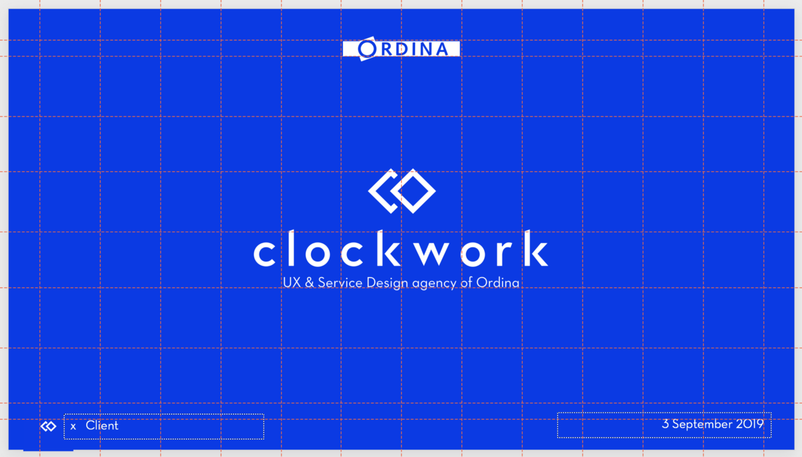

Or/and: How to quit wasting your audience’s time?

*This year, the Bold team attended the UXinsights conference in Utrecht. In general, the talks by industry-renowned speakers were well prepared and well brought to life in a TED talk manner. However, a couple of speeches (of lesser-known speakers) lacked fine-tuning and structure. And then there was one talk of a British professor lady which just blew the audience away.*

*She presented her insights about robotics and 5G and the impact on design in such a manner that the crowd hung on her every word. The funny thing though is that the content of her talk was maybe the least interesting of all day.*

### Elevate your communication skills.

So what was it that made her stand out that day? It must have been the way she expressed her thoughts and feelings. She almost perfectly followed the TED talks principles. We’re talking about carefully crafted speeches that use scientifically proven methods to captivate the attention of the audience.

In this blog post, we will teach you how great presentations come to life and how to apply the knowledge in your day-to-day work-and personal context. This is especially important for all our colleagues in the design industry who spend hours and hours making pixel-perfect designs or perfectly worked out research reports. There’s often a significant gap between the quality of our work and how much of it is thrown away simply because it wasn’t communicated properly.

## What makes great presentations

Pitches, research reports, ideation outcomes, design presentations or status updates. Most of us are deeply involved in making presentations at work. But yet there are a lot of significant companies where using 4:3 powerpoint slides is the standard. To change this old-fashioned way of working, we divided the presentation process in four:
1. Presentation prep
2. The presentation
3. Presenting
4. After the Presentation

### 1. Presentation prep

At TED, the preparation of an important talk takes months: each speaker is being trained and guided in speaking tactics and stage performance. A coach continuously checks the structure so that the presentation is a living document. Don’t prepare your presentation just before the talk. An excellent presentation document is carefully crafted; it should support your message and bring your talk to live. Another tip: Email the agenda to the audience in advance, manage the audience’s expectations, and outline the expected outcome. But the most important thing before a presentation is that you rehearse and practice until you feel confident to go and speak to your audience.

### 2. The presentation

We bet all of us have once been part of an audience during a tiresome presentation given by a dull and uncharismatic c-suite person.
> Isn’t it crazy how people who deliver speeches to hundreds of people daily are not aware of their audience?

Through user-centered design, we’re building usable and desirable products, but yet we see so many designers fail to inspire **the audience** when presenting these user-centered designs. So before every presentation you give, think about who you are making it for! 
One of the most important things is the **flow** of your presentation. Great speakers understand this very well, they vary their pace and tell real stories to give context to the points they want to emphasize. Storytelling is one of the most powerful tools we can use to communicate. But the term has been overused so much that it’s lost its meaning.

What we mean when we mention **storytelling** is a rather simple and hands-on model: No long fireplace stories, it’s the simple things that make the best impression. So the most simplistic storytelling model still is the **three-act story model** used in almost every theatre piece. It consists of three acts: beginning, middle and end, and the tension rising throughout the story.
To apply this to a real world scenario, think of this: You’ve conducted some user interviews and you want to present this to the project stakeholders. Your story could be as simple as this: 
- What did we want to test?
- What did we learn along the way?
- How will we use these insights?
By splitting up your story into three acts, you provide a model to the audience which they know and which they can naturally follow. This is a crucial part of presentation success! Or as the famous usability author Steve Krug titled his world-renowned book: “Don’t make me think.”

Most stories do not need to be split up in more than three acts.If you have the desire to tell your audience more about your story, split the three acts up in sub stories. For our research presentation, it could look like this: 
What did we want to test? -> How did we do that?
What did we learn along the way? -> What did the participants say?
How will we use these insights? -> How will this impact our product strategy?
> If you can’t communicate emotions through stories, people will simply forget your talk. And that’s what happened to 90% of the talks we’ve seen at the UXinsights event.

Now let’s talk about your **slides**. There are some simple guidelines here too: 
First of all, limit the number of slides you use and limit the scope to what’s achievable. If you don’t, people will get overwhelmed, and they will stop listening eventually. On your slides, think of each and every element. A good exercise here can be to push yourself to throw away half of the slides in every presentation. You’ll learn how much is actually unnecessary and taking away focus from your main message.
Your slides are there to support your talk, not to control it. The whole thing is about you and the words that you say. No slide will ever help you deliver a better presentation if your stories and message are not thought out well.

As for the slide design, make it visual and stick to a consistent style. People have a very limited attention span, so don’t let that go to waste. If you have the time and a big team, craft a presentation template. This dramatically reduces the time and thinking which goes typically into visually designing slides.

When you’re **presenting design work**; always state the design’s intent, how the visual design supports it, and how it accomplishes business goals. Don’t get caught up in the details of elements on the page, your clients should care about their business and strategy and leave the design work to you. And most importantly: Never ask “Do you like it?”. It makes you seem like a little child that asks for approval for a drawing it made. For research presentations, engage the audience by telling research stories, no client loves to read 150 pages of research outcomes.

### 3. Presenting

Stop stressing out for your big pitch but embrace the moment, focus your energy and go for it. Because if you don’t, you’ll waste your chance to make an impact. Breathe deeply, step on the stage and give it your best. And never, ever apologize for being nervous. It makes you vulnerable and you let the audience judge you as a person instead of judging your work. 
Also don’t move too much and choose four to five people to make eye contact with. These persons are your anchor, they will feel needed and will interact with you during the presentation.

Firstly, **thank them** for being there and introduce the topic. Summarize the client brief and recap research outcomes. A great introduction can sound like this:“Thanks to everyone for being here today. We’re happy that everybody could come because we would like to get approval for the app’s designs in this meeting. In the briefing, we were told that the goal is to up sales of product XY by 10%. Our user testing shows that this is possible, so let’s take a look at the designs and the testing outcomes.”

As for **communication techniques**, you can stick to two models that Harvard Business School is using to teach their students.

*1. VAK learning styles*
VAK stands for visual, auditory and kinesthetic; three learning and communication styles.This means that there are different people with different personalities and that you should communicate so that all these people feel comfortable.
- Visual type: nice charts, energetic presentation, extroverted personality
- Auditory type: listening, personal stories, softer type of person
- Kinesthetic type: skeptic, quiet, introverted personality
In general, the kinesthetic type in your audience will be a little shocked if you start off by screaming or playing rock music while the visual type will maybe love this. That means that you should start off slowly to comfort the kinesthetic type and slowly up the pace and energy to also cater the auditory and visual type.

*2. Charismatic leadership tactics*
These are communication basics that have been proven to work in most interactions we have with other humans.
Metaphores: Use visual language
Contrast: Turn the question around
Three part lists: They just work
Map success: It’s always team success
So when presenting, make sure that you control your mind, introduce the topic properly and work with advanced communication methods.

### 4. After the presentation

You’ve made it. The presentation is done and your audience is motivated and ready to act upon your solutions. To finish strong and really make a difference, some points are crucial.
You should always put your findings into context and include **actionable next steps**. Tell the audience what has to be done by whom to guarantee success. After the presentation, send a debrief to everyone who attended and thank them for being there.

## The takeaway

When crafting presentations, you should take into account the following things:
- Prepare and rehearse
- Mind the audience
- Think of each and every slide
- Tell stories to bring your talk to life
- Use proven communication techniques
- Summarise and finish with call-to-actions

Need help to introduce this into your organisation? We’ll be happy to collaborate. Get in touch with us!
